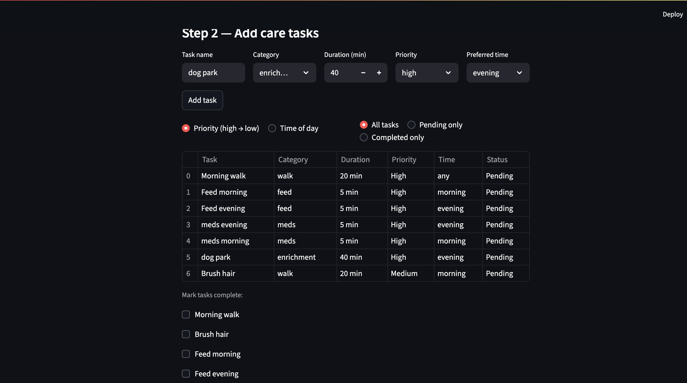
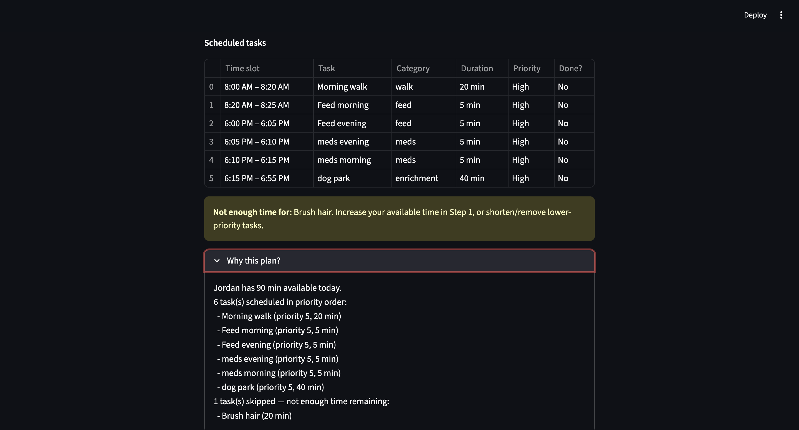
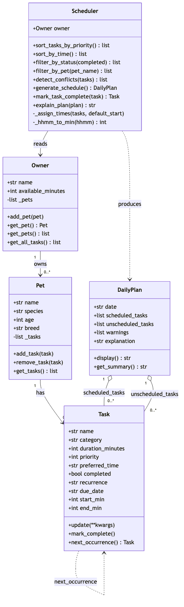

# PawPal+ — Daily Pet Care Scheduler

A Streamlit app that helps a pet owner plan and track care tasks for their pet. The owner enters their daily time budget, adds tasks with priorities and preferred times, and PawPal+ generates an optimised daily schedule — sorted, conflict-checked, and explained in plain English.

---

## Table of Contents

- [Quick Start](#quick-start)
- [Features](#features)
- [How It Works](#how-it-works)
- [Demo](#-demo)
- [Project Structure](#project-structure)
- [Testing](#testing)
- [UML Class Diagram](#uml-class-diagram)
- [Smarter Scheduling](#smarter-scheduling)

---

## Quick Start

```bash
python -m venv .venv
source .venv/bin/activate      # Windows: .venv\Scripts\activate
pip install -r requirements.txt
streamlit run app.py
```

---

## Features

### Core workflow
| Step | What it does |
|---|---|
| **1 — Profile** | Enter owner name, daily time budget (minutes), pet name, species, and age. |
| **2 — Tasks** | Add care tasks with name, category, duration, priority, and preferred time of day. |
| **3 — Schedule** | One-click generates an optimised daily plan and explains every decision. |

### Scheduling algorithms

**Priority-based greedy scheduling**
`Scheduler.generate_schedule()` sorts all tasks highest-priority first (using `sort_tasks_by_priority()`), then greedily assigns tasks to the day until the owner's time budget runs out. This guarantees that the most important tasks (medication, feeding) are always placed before optional enrichment activities.

**Time-of-day slot assignment**
`Scheduler._assign_times()` runs a forward-moving cursor starting at 8:00 AM. Each task with a `preferred_time` snaps the cursor forward to that window (if it hasn't passed), so tasks never run backwards in time. Tasks without a preference are placed immediately after the previous one.

**Sorting by time of day**
`Scheduler.sort_by_time()` orders tasks chronologically by their `preferred_time` (`HH:MM` strings). A two-key lambda `(is_none, time_str)` ensures tasks with no preference always sort to the end without any `datetime` parsing.

**Sorting by priority**
`Scheduler.sort_tasks_by_priority()` returns the full task list sorted descending by `priority` (1–5). Used both inside `generate_schedule()` and exposed to the UI as a live sort control.

**Status filtering**
`Scheduler.filter_by_status(completed)` returns either pending or completed tasks across all pets. Drives the "Pending only / Completed only" filter in the task table.

**Per-pet filtering**
`Scheduler.filter_by_pet(name)` returns the task list for a single named pet (case-insensitive). Useful when an owner manages multiple animals.

**Conflict detection**
`Scheduler.detect_conflicts(tasks)` checks every unique pair of scheduled tasks (via `itertools.combinations`) for overlapping `preferred_time` windows using the standard interval-overlap test: `a_start < b_end AND b_start < a_end`. Only tasks with an explicit preferred time are checked — flexible tasks are intentionally excluded to avoid noise. Conflicts are surfaced as `st.warning` banners in the UI with exact time windows so the owner knows exactly which tasks to reschedule.

**Daily and weekly recurrence**
`Task.next_occurrence()` computes the next due date using `timedelta` (daily = +1 day, weekly = +7 days) and returns a fresh `Task` copy. `Scheduler.mark_task_complete(task)` calls this automatically and appends the new occurrence to the correct pet's task list — no manual re-entry required.

### UI components
- Sort & filter controls in Step 2 (`st.radio` + `st.table`) let the owner see tasks ordered by priority or time of day, filtered by completion status.
- Schedule output (Step 3) shows a structured table with computed time slots (e.g. `8:00 AM – 8:20 AM`), not raw text.
- Unscheduled tasks surface as `st.warning` with actionable advice (increase time budget or remove lower-priority tasks).
- Conflict banners use `st.error` + `st.warning` in a two-level hierarchy: a red summary count at the top, then one detailed warning per conflicting pair.

---

## How It Works

```
Owner  ──owns──▶  Pet  ──has──▶  Task
                                  │
Scheduler ──reads──▶ Owner        │ next_occurrence()
Scheduler ──produces──▶ DailyPlan │◀──────────────────┘
DailyPlan ──contains──▶ Task (scheduled + unscheduled)
```

`Scheduler` is the only class with logic; all others are data containers. It reads the time budget from `Owner`, reads all tasks via `owner.get_all_tasks()`, and writes its output into a `DailyPlan` that the UI renders.

---

## 📸 Demo

### Step 1 — Set up your profile


*Enter your name, how many minutes you have today, and your pet's details. The status caption updates immediately after saving.*

### Step 2 — Add and sort care tasks


*Tasks appear in a sortable table. Use the radio buttons to switch between priority order and time-of-day order, or filter to pending/completed tasks only.*

### Step 3 — Generated schedule


*Each scheduled task shows its computed time slot. Tasks that don't fit appear in a yellow warning with a specific action to take.*

> **To add your own screenshots:** save the three images above as `assets/demo-step1.png`, `assets/demo-step2.png`, and `assets/demo-step3.png`.

---

## Project Structure

```
pawpal-starter/
├── app.py               # Streamlit UI — all three workflow steps
├── pawpal_system.py     # Domain model: Owner, Pet, Task, Scheduler, DailyPlan
├── tests/
│   └── test_pawpal.py   # Pytest suite (11 tests)
├── assets/              # Screenshots for README
├── uml_final.png        # Final UML class diagram (rendered from uml_final.mmd)
├── uml_final.mmd        # Mermaid source for UML diagram
├── reflection.md        # Design notes and AI collaboration log
└── requirements.txt
```

---

## Testing

```bash
python -m pytest tests/test_pawpal.py -v
```

| Area | Tests | What is verified |
|---|---|---|
| **Sorting** | `test_sort_by_time_chronological_order`, `test_sort_by_time_none_times_last` | Tasks with `preferred_time` are returned in ascending HH:MM order; tasks with no time sort last |
| **Recurrence** | `test_daily_recurrence_advances_one_day`, `test_weekly_recurrence_advances_seven_days`, `test_mark_task_complete_adds_recurrence_to_pet`, `test_non_recurring_task_returns_none` | Daily tasks advance 1 day, weekly tasks advance 7 days, the new occurrence is appended to the correct pet, non-recurring tasks return `None` |
| **Conflict detection** | `test_conflict_detected_for_same_time`, `test_no_conflict_for_sequential_tasks`, `test_no_conflict_for_tasks_without_preferred_time` | Overlapping windows produce a warning; sequential and flexible tasks produce none |
| **Core model** | `test_mark_complete_changes_status`, `test_add_task_increases_pet_task_count` | `Task.mark_complete()` flips the flag; `Pet.add_task()` grows the task list |

All 11 tests pass. `generate_schedule` end-to-end and the UI layer do not yet have dedicated tests.

---

## UML Class Diagram



The source Mermaid code is in [uml_final.mmd](uml_final.mmd). To regenerate the PNG:

```bash
npx @mermaid-js/mermaid-cli -i uml_final.mmd -o uml_final.png -b white
```

---

## Smarter Scheduling

Beyond the greedy priority planner, PawPal+ includes:

- **`sort_by_time()`** — chronological task order with flexible tasks at the end.
- **`filter_by_status(completed)`** — show only what still needs to be done today.
- **`filter_by_pet(name)`** — task list scoped to one pet by name.
- **`detect_conflicts(tasks)`** — flags overlapping preferred-time windows with exact timestamps.
- **`mark_task_complete(task)`** — auto-queues the next occurrence for recurring tasks.
- **`_assign_times(tasks)`** — forward-cursor slot assignment respecting preferred times.
