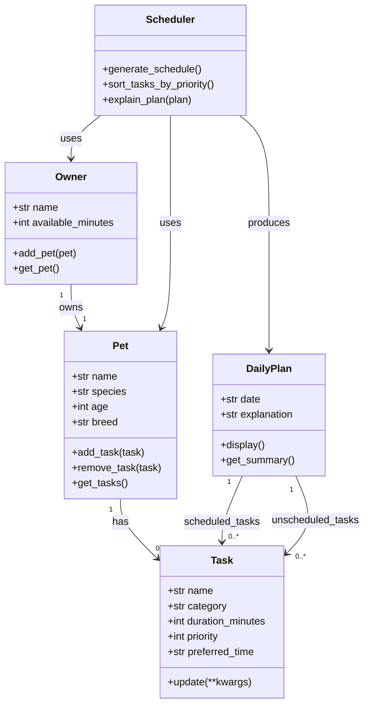

# PawPal+ Project Reflection

## 1. System Design

**a. Initial design**

- Briefly describe your initial UML design.

The three core actions a user should be able to perform in PawPal+ are:

1. **Set up an owner and pet profile** — The user enters basic information about themselves (the owner) and their pet (name, species, age, etc.). This gives the scheduler the context it needs to tailor care recommendations.

2. **Add and manage care tasks** — The user creates, edits, and removes pet care tasks such as walks, feedings, medication, grooming, and enrichment. Each task has at minimum a duration and a priority level so the scheduler knows how much time each requires and how important it is.

3. **Generate and view a daily schedule** — The user requests a daily plan. The scheduler considers the available time window, task priorities, and any preferences or constraints, then produces an ordered schedule and explains why it chose that plan.

- What classes did you include, and what responsibilities did you assign to each?

The system is built around five main objects:

**Owner**
- Holds: `name` (str), `available_minutes` (int — total daily time budget in minutes)
- Can: `add_pet(pet)`, `get_pet()` — manages the association between the owner and their pet

**Pet**
- Holds: `name` (str), `species` (str), `age` (int), `breed` (str, optional)
- Can: `add_task(task)`, `remove_task(task)`, `get_tasks()` — owns the list of care tasks assigned to this pet

**Task**
- Holds: `name` (str), `category` (str — e.g. walk, feed, meds, grooming, enrichment), `duration_minutes` (int), `priority` (int 1–5, where 5 is most urgent), `preferred_time` (str, optional — e.g. "morning", "evening")
- Can: `update(**kwargs)`, `__repr__()` — encapsulates everything the scheduler needs to know about one care activity

**Scheduler**
- Holds: `pet` (Pet), `owner` (Owner), `tasks` (list of Task)
- Can: `generate_schedule()` — produces a DailyPlan by sorting tasks and fitting them within the owner's time budget; `sort_tasks_by_priority()` — orders tasks highest-priority first; `explain_plan(plan)` — returns a human-readable explanation of scheduling decisions

**DailyPlan**
- Holds: `date` (str), `scheduled_tasks` (list of Task — those that fit), `unscheduled_tasks` (list of Task — those that didn't fit in the time budget), `explanation` (str)
- Can: `display()` — formats the plan for the UI; `get_summary()` — returns a short text summary of what was scheduled and what was skipped

**UML Class Diagram**

**b. Design changes**

- Did your design change during implementation?
- If yes, describe at least one change and why you made it.

---

## 2. Scheduling Logic and Tradeoffs

**a. Constraints and priorities**

- What constraints does your scheduler consider (for example: time, priority, preferences)?
- How did you decide which constraints mattered most?

**b. Tradeoffs**

- Describe one tradeoff your scheduler makes.
- Why is that tradeoff reasonable for this scenario?

---

## 3. AI Collaboration

**a. How you used AI**

- How did you use AI tools during this project (for example: design brainstorming, debugging, refactoring)?
- What kinds of prompts or questions were most helpful?

**b. Judgment and verification**

- Describe one moment where you did not accept an AI suggestion as-is.
- How did you evaluate or verify what the AI suggested?

---

## 4. Testing and Verification

**a. What you tested**

- What behaviors did you test?
- Why were these tests important?

**b. Confidence**

- How confident are you that your scheduler works correctly?
- What edge cases would you test next if you had more time?

---

## 5. Reflection

**a. What went well**

- What part of this project are you most satisfied with?

**b. What you would improve**

- If you had another iteration, what would you improve or redesign?

**c. Key takeaway**

- What is one important thing you learned about designing systems or working with AI on this project?
