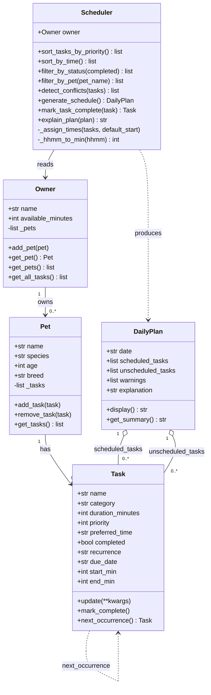

# PawPal+ Project Reflection

## 1. System Design

**a. Initial design**

- Briefly describe your initial UML design.

    - The design uses five classes arranged in a clear ownership chain: `Owner` holds a reference to one `Pet`, and `Pet` owns a list of `Task` objects. A separate `Scheduler` class reads from `Owner` (for the time budget) and `Pet` (for the task list) and produces a `DailyPlan` as output. This separation keeps data (Owner, Pet, Task) cleanly apart from logic (Scheduler) and output (DailyPlan). `Task` and `Pet` are implemented as Python dataclasses since they are primarily data containers; `Owner`, `Scheduler`, and `DailyPlan` are regular classes because they involve more stateful or behavioral logic.

    The three core actions a user should be able to perform in PawPal+ are:

    1. **Set up an owner and pet profile** — The user enters basic information about themselves (the owner) and their pet (name, species, age, etc.). This gives the scheduler the context it needs to tailor care recommendations.

    2. **Add and manage care tasks** — The user creates, edits, and removes pet care tasks such as walks, feedings, medication, grooming, and enrichment. Each task has at minimum a duration and a priority level so the scheduler knows how much time each requires and how important it is.

    3. **Generate and view a daily schedule** — The user requests a daily plan. The scheduler considers the available time window, task priorities, and any preferences or constraints, then produces an ordered schedule and explains why it chose that plan.

- What classes did you include, and what responsibilities did you assign to each?

    - The system is built around five main objects:

    **Owner**
    - Holds: `name` (str), `available_minutes` (int — total daily time budget in minutes)
    - Can: `add_pet(pet)`, `get_pet()` — manages the association between the owner and their pet

    **Pet**
    - Holds: `name` (str), `species` (str), `age` (int), `breed` (str, optional)
    - Can: `add_task(task)`, `remove_task(task)`, `get_tasks()` — owns the list of care tasks assigned to this pet

    **Task**
    - Holds: `name` (str), `category` (str — e.g. walk, feed, meds, grooming, enrichment), `duration_minutes` (int), `priority` (int 1–5, where 5 is most urgent), `preferred_time` (str, optional — e.g. "morning", "evening")
    - Can: `update(**kwargs)`, `__repr__()` — encapsulates everything the scheduler needs to know about one care activity

    **Scheduler**
    - Holds: `pet` (Pet), `owner` (Owner), `tasks` (list of Task)
    - Can: `generate_schedule()` — produces a DailyPlan by sorting tasks and fitting them within the owner's time budget; `sort_tasks_by_priority()` — orders tasks highest-priority first; `explain_plan(plan)` — returns a human-readable explanation of scheduling decisions

    **DailyPlan**
    - Holds: `date` (str), `scheduled_tasks` (list of Task — those that fit), `unscheduled_tasks` (list of Task — those that didn't fit in the time budget), `explanation` (str)
    - Can: `display()` — formats the plan for the UI; `get_summary()` — returns a short text summary of what was scheduled and what was skipped

**UML Class Diagram (final — see also `uml_final.png`)**

**AI feedback on the design**

Reviewing `pawpal_system.py`, one potential logic bottleneck stands out: `Scheduler.__init__` currently takes both `owner` and `pet` as separate arguments, but `Owner` already holds the pet via `get_pet()`. This creates a redundant dependency — a caller could accidentally pass a `pet` that doesn't belong to the given `owner`, which would silently produce a wrong schedule. A cleaner design would have `Scheduler` accept only `owner` and derive the pet internally via `owner.get_pet()`. This enforces the ownership relationship that already exists in the model.

**b. Design changes**

- Did your design change during implementation?
- If yes, describe at least one change and why you made it.

    - Yes. Based on the AI feedback above, `Scheduler.__init__` was simplified to accept only `owner` as an argument. The `pet` is now derived inside the constructor via `owner.get_pet()`. This change was made because passing `pet` separately was redundant — `Owner` already owns the pet — and introduced a risk of mismatched arguments. Removing the redundant parameter makes the API harder to misuse and better reflects the actual ownership structure of the model.

---

## 2. Scheduling Logic and Tradeoffs

**a. Constraints and priorities**

- What constraints does your scheduler consider (for example: time, priority, preferences)?
- How did you decide which constraints mattered most?

    The scheduler considers three constraints, applied in this order:

    1. **Time budget** — `Owner.available_minutes` is a hard cap. A task that would push the total over budget is placed in `unscheduled_tasks` and never scheduled, regardless of priority. This is the strictest constraint because there is no way to create more time in a day.

    2. **Priority** — Tasks are sorted highest-to-lowest (1–5 scale) before the greedy loop runs. This means a high-priority medication task will always be placed before a lower-priority enrichment activity, even if the enrichment task was added first.

    3. **Preferred time of day** — `_assign_times()` respects `preferred_time` using a forward-moving cursor: if the cursor is already past the requested time, the task runs immediately after the previous one rather than being skipped. This constraint is "soft" — it is honoured when possible but never causes a task to be dropped.

    Priority was chosen as the primary ordering constraint because the core use case is a busy pet owner who must not miss medication or feeding. Time-of-day preference is secondary because the scheduler can still produce a useful plan if an owner is a few minutes late starting a walk, but missing medication has real consequences.

**b. Tradeoffs**

- Describe one tradeoff your scheduler makes.
    - **Conflict detection only flags tasks that have an explicit `preferred_time`.**
    - The `detect_conflicts` method builds intervals only for tasks where `preferred_time` is set (e.g. `"07:00"`). Tasks without a preferred time are assigned sequentially by a time cursor in `_assign_times` and are never checked for overlap against each other or against timed tasks.
    - This means a task scheduled by the cursor could land inside a window already claimed by a preferred-time task, and no warning would be generated for that collision.

- Why is that tradeoff reasonable for this scenario?
    - Pet care tasks that have no time preference (e.g. "Brush fur") are flexible by definition — the owner is explicitly saying "fit this wherever." Flagging those as conflicts would produce noise rather than actionable warnings. The meaningful conflicts are when an owner explicitly requests two tasks at the same clock time (e.g., a walk and a feeding both at `"07:00"`), which is exactly what the current check catches. A fully general solution would require solving a constraint-satisfaction problem, which is far more complexity than a daily pet care planner needs.

---

## 3. AI Collaboration

**a. How you used AI**

- How did you use AI tools during this project (for example: design brainstorming, debugging, refactoring)?
- What kinds of prompts or questions were most helpful?

    AI tools (VS Code Copilot and Claude Code) were used across all four phases, but with a deliberately different role in each:

    - **Phase 1 — Design:** I used Copilot Chat with `#codebase` to pressure-test the UML before writing any code. The most useful prompt pattern was asking it to play critic: *"What are the weakest points in this class structure?"* rather than *"Design a scheduler for me."* This produced targeted feedback (the redundant `pet` argument in `Scheduler`) instead of a fully AI-generated design that I would not have fully understood.

    - **Phase 2 — Core implementation:** Copilot's inline autocomplete was most effective here for filling out dataclass fields and writing docstrings after I had typed the method signature. I wrote the method names and parameter types myself; Copilot completed the body. This kept me in control of the API surface while offloading repetitive boilerplate.

    - **Phase 3 — Smarter scheduling:** I used Copilot Chat with `#file:pawpal_system.py` to ask targeted questions like *"What is the most Pythonic way to check every unique pair of tasks for overlap without nested index loops?"* — which led to the `itertools.combinations` approach in `detect_conflicts`. The specific file context made the suggestions directly applicable rather than generic.

    - **Phase 4 — UI integration:** Claude Code was used to identify a bug (the `preferred_time` format mismatch between the Streamlit UI and the backend) and to update the display logic to use the Scheduler's sort and filter methods. The most useful framing was describing the *symptom* ("the generate button would crash when preferred_time was set") rather than asking for a fix directly, which forced a proper diagnosis before any code was written.

    The prompt patterns that worked best were: asking for critique of existing design, asking *why* a pattern is idiomatic rather than just *what* to write, and always providing file context (`#file:`, `#codebase`) so suggestions were grounded in the actual code.

**b. Judgment and verification**

- Describe one moment where you did not accept an AI suggestion as-is.
- How did you evaluate or verify what the AI suggested?

    When integrating the UI in Phase 4, AI suggested handling the `"morning"/"afternoon"/"evening"` preferred-time strings inside the `Scheduler` and `Task` classes themselves — adding a branch like `if preferred_time in ("morning", "afternoon", "evening"): preferred_time = TIME_MAP[preferred_time]` directly inside `_hhmm_to_min()`.

    I rejected this for two reasons. First, it would have broken the clean separation between the domain model (`pawpal_system.py`) and the UI layer (`app.py`): the backend would now contain knowledge about how the Streamlit form was labelled, which is a UI concern. Second, the existing tests for `_hhmm_to_min` all used `"HH:MM"` strings and would have needed to be rewritten.

    Instead, I kept the backend contract (`preferred_time` is always `None` or a `"HH:MM"` string) and added a `TIME_LABEL_TO_HHMM` mapping in `app.py` that converts the human-readable label to `"HH:MM"` at the moment the `Task` is constructed — the boundary where UI data enters the domain model. I verified this was correct by checking that all existing tests still passed unchanged after the UI fix, which confirmed the backend contract was not touched.

---

## 4. Testing and Verification

**a. What you tested**

- What behaviors did you test?
- Why were these tests important?

    Eleven tests cover four areas:

    - **Sorting by time** — Two tests verify that `sort_by_time()` returns tasks in ascending `HH:MM` order and that tasks with no `preferred_time` always sort last. These were important because the sort key uses a two-part lambda tuple rather than `datetime` parsing; without tests it would be easy to accidentally break the `None`-last guarantee with a refactor.

    - **Recurrence** — Four tests check that `next_occurrence()` advances by exactly one day for `"daily"` and seven days for `"weekly"`, that `mark_task_complete()` appends the new task to the correct pet's list (not a different pet), and that non-recurring tasks return `None`. Recurrence mutates state on a specific `Pet` object, so testing the identity of *which* pet received the task was essential to catch the bug where a task could be appended to the wrong pet.

    - **Conflict detection** — Three tests cover the three critical paths: overlapping windows produce exactly one warning string, sequential non-overlapping windows produce no warnings, and tasks without `preferred_time` are never flagged. These were important because the conflict logic uses `itertools.combinations` over an interval-overlap formula — both easy to get subtly wrong — and the tests give precise regression coverage for all three branches.

    - **Core model** — Two tests confirm that `Task.mark_complete()` sets `completed = True` and that `Pet.add_task()` increases the task count. These are simple but act as a sanity baseline: if the data model breaks, every other test fails too, and these isolate the root cause quickly.

**b. Confidence**

- How confident are you that your scheduler works correctly?
- What edge cases would you test next if you had more time?

    **Confidence: 4 / 5.**

    The sorting, recurrence, and conflict detection logic is well-covered and all 11 tests pass consistently. Confidence drops one star because `generate_schedule()` — the end-to-end greedy planner — has no dedicated test. It is exercised indirectly (the UI calls it) but the specific time-budget boundary (e.g., a task that fits exactly to the minute, or tasks that collectively exceed the budget by one minute) is not tested.

    Edge cases to test next:
    - **Exact budget fit** — total task duration equals `available_minutes` exactly; every task should be scheduled and `unscheduled_tasks` should be empty.
    - **Single task exceeds budget** — a 120-minute task when the owner only has 90 minutes; it should go straight to `unscheduled_tasks` rather than partially scheduled.
    - **All tasks same priority** — scheduler should preserve insertion order as a tiebreaker.
    - **Recurrence with no `due_date`** — `next_occurrence()` falls back to `date.today()`; a test should confirm the returned date is tomorrow rather than an arbitrary date.
    - **`filter_by_pet` with unknown name** — should return an empty list, not raise an exception.

---

## 5. Reflection

**a. What went well**

- What part of this project are you most satisfied with?

    The separation between the domain model and the UI layer held up cleanly throughout the project. `pawpal_system.py` never imports Streamlit; `app.py` never contains scheduling logic. When the `preferred_time` format bug was discovered during Phase 4, fixing it required changing exactly one place — the `TIME_LABEL_TO_HHMM` mapping in `app.py` — and all 11 backend tests passed unchanged. That outcome validated the original design decision to keep the two layers independent.

    The conflict detection implementation is also satisfying. Using `itertools.combinations` to enumerate pairs and the standard interval-overlap formula (`a_start < b_end AND b_start < a_end`) produced a solution that is both correct and readable in about five lines. The three test cases cover all branches precisely, so there is high confidence in that method specifically.

**b. What you would improve**

- If you had another iteration, what would you improve or redesign?

    Two things:

    1. **`preferred_time` as a proper type, not a raw string.** The current design stores `preferred_time` as an `Optional[str]` in `"HH:MM"` format, which means the backend must parse and validate it every time it is used. In a next iteration I would store it as an `Optional[datetime.time]` object, which would eliminate `_hhmm_to_min()` entirely, make sorting and arithmetic direct, and shift validation to the point where the value is first created rather than every point where it is consumed.

    2. **End-to-end test for `generate_schedule`.** The greedy planner is the core of the app but has no dedicated test. I would add a parameterised test that runs the scheduler with a known set of tasks and a fixed time budget, then asserts the exact contents of `scheduled_tasks`, `unscheduled_tasks`, and `warnings`. This would catch regressions in the full pipeline — priority ordering, time assignment, and conflict detection together — rather than each in isolation.

**c. Key takeaway**

- What is one important thing you learned about designing systems or working with AI on this project?

    The most important lesson was that **AI is most useful when you already have a clear design and use it to challenge or fill in that design — not to generate the design itself.**

    Every time I gave AI an open-ended prompt ("build me a scheduler"), the output was generic and required significant rework to fit the actual constraints of the project. Every time I gave it a specific, bounded question — *"What is the risk of this constructor signature?"*, *"What Python builtin is best for enumerating unique pairs?"* — the output was directly applicable and saved real time.

    This maps onto a broader principle about working with powerful AI tools: the human's job is to be the lead architect, which means owning the decisions about what the system *should* do, how the components *should* relate, and what tradeoffs are acceptable for this specific problem. AI is a skilled collaborator that can implement within those decisions, find edge cases, and suggest idioms — but it does not know the constraints of your project unless you supply them precisely. The quality of the AI's output is bounded by the quality of the human's design thinking going in.
